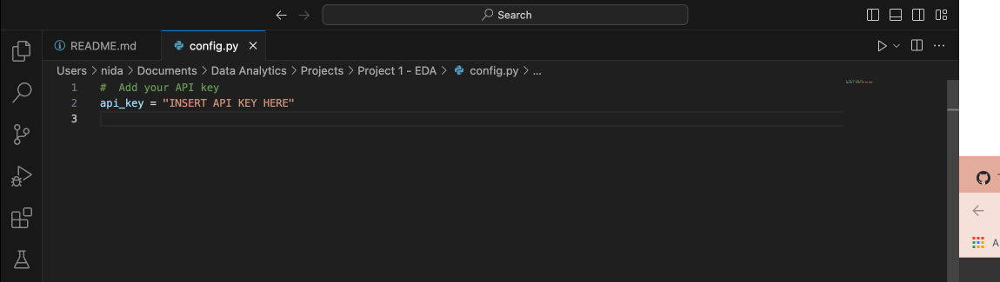

# Evolving Landscapes of Television: An Analytical Dive into TV Show Trends on Netflix

### Objective:
This project aims to conduct a comprehensive analysis of TV shows available on Netflix, focusing on their evolution over time, the impact of the pandemic on genre popularity, regional production trends, and the relationship between IMDb scores, votes, and genres. The analysis will leverage a primary dataset from Kaggle along with supplementary data from the OMDB API. By examining various aspects such as maturity ratings, genre popularity, production trends, and viewer ratings, the study aims to offer valuable insights for content creators, media strategists, and streaming service analysts.

##  Contents

* [Dataset](#dataset-header)
* [Project Outline](#project-header)
* [Example Plots](#example-header)
* [Findings Reports and Presentation](#reports-header)
* [Dependencies and Setup Required](#dependencies-header)
* [How to View / Run the code](#how-header)
* [Jupyter Notebooks File Guide](#which-header)
* [Repository Structure](#structure-header)
* [Team](#team-header)

## Dataset

Our primary dataset was the [Netflix Movies and Shows](https://www.kaggle.com/datasets/maso0dahmed/netflix-movies-and-shows/data)\
This dataset provides a comprehensive view of movies and shows available on Netflix. It captures a range of information, offering insights into the type of content, its popularity, and other significant aspects.\
Available from [Kaggle.com](https://www.kaggle.com)

There was one CSV file in this data set. 
* imdb_movies_shows.csv

The file should be placed in the Resources/ Directory:

Supplemental information on languages using the imdb_id was added from the OMDB API - this was not availible in the original dataset.

The process of data collection, cleanup, and exploration was meticulously carried out to ensure that the resulting dataset is both comprehensive and relevant for detailed analysis. The integration of external API data from OMDB significantly enhanced the dataset's utility, making it a robust resource for exploring trends in Netflix's TV show offerings. The prepared dataset, now saved as netflix_shows.csv(Resources/netflix_shows.csv), is well-positioned to provide insightful answers to the research questions posed in the project.

**Data Limitations**\
It must be noted that the data was limited in scope e.g. while we had information on the total IMDB votes, we did not have data on the timing of these votes or viewer watch times. Therefore, despite some interesting findings, the plots extracted from the data although **"true"**, do not **"tell the entire story".**

## Project Outline

We decided to tackle a number of key questions:
* **Genre Production Patterns**
- What can be inferred about Netflix's content strategy based on the genres and types of shows produced?
- How has the diversity of production regions and languages changed over time on Netflix?
- How does Netflix's content portfolio compare with its initial years versus the more recent years?

* **IMDb Score, Votes, and Genre Relationship**
- Are certain genres consistently receiving higher ratings and votes?
- Are older shows maintaining popularity, or is there a trend towards newer releases?
- What factors contribute to higher viewer engagement and popularity for TV shows on Netflix? 

* **Maturity Rating Evolution**
- How do different age certifications (like TV-MA, TV-14) perform in terms of quantity and popularity?
- Does this reflect any broader market trends or shifts in audience demographics?

* **Pandemic and Reality TV Popularity**
- Was there a significant rise in the popularity of reality TV shows during the pandemic, and has this increase been sustained post-pandemic?
- How do scripted TV shows perform in comparison to non-scripted ones in terms of IMDb scores, viewer engagement, and production rates?

In an attempt to address each question, we created a number of [visualisations](#example-header) to display the data in an easier to analyse format which helped us understand the information required.

## Example Plots
Here are 2 examples visualisations we created from the data.\
The plots can be found in the [/Images](/Images) folder after running the code in the Notebook files that are in the root directory.

</img>
</img>

## Findings Reports and Presentation

The findings of this project can be found in the [/Presentation](Presentation/) directory.

There are 3 files:

* 01_Project_Proposal.pdf
* 02_Presentation.pdf
* 03_Project_Report.pdf

## Dependencies and Setup Required

In order to run the files you will need to install the following packages.

* pandas `pip install pandas`
* seaborn `pip install seaborn`
* matplotlib `pip install matplotlib`
* scipy `pip install scipy`
* ast `pip install ast`
* jupyter notebook `pip install notebook`

**OMDB API Key requirement**

For OMDB you will also need an API key, to run more than 1000 requests a day, from the [The Open Movie Database](https://www.omdbapi.com/apikey.aspx). Please visit the OMDB platform to set up an API key if you do not already have one.

1. [config.py - Click to Download](https://drive.google.com/file/d/1ZFgFTRgwHNvPS26gBwVRQA_EY4YsRcq-/view?usp=sharing)

2. Open the file in a text editor or VS code and change "INSERT API KEY HERE" to your API key from the OMDB API.

3. The config.py file should be stored in your local repository root folder.

## How to View / Run the Code

The work was completed primarily using Jupyter Notebooks and the modules listed in the Dependencies section.

1. Clone the repository

2. Complete steps in the [Dependencies and Setup Required](#dependencies-header) section above.

3. Open any of the Jupyter Notebook files (.ipynb) in the root directory and run the cells in order.

The Jupyter notebook files have comments in the code and Markdown cells beneath each step explaining what was done in the cell above.

For a short description of what each notebook contains, please see the [Jupyter Notebooks File Guide](#which-header) section below.

## Jupyter Notebooks File Guide

* 01_data_cleanup.ipynb - Initial data processing and filtering
* 02_genre_production_patterns.ipynb - Explores links between Netflix's content strategy over time
* 03_imdb_scores_votes_genres.ipynb - Explores what makes a Netflix show popular
* 04_maturity_rating_evolution.ipynb - Explores broader market trends or shifts in audience demographics
* 05_pandemic_reality_tv.ipynb - Explores if the pandemic changed viewing habits in favour of non-scripted reality TV

## Repository Structure

* Notebook code files in the root directory [root/](/)
* Presentation and report files in the Presentation directory [Presentation/](Presentation/)
* Image and Plots in the Images directory [Images](Images/)
* Dataset files in the Resources directory [Resources](Resources/)

## Credits / Collaborators / Team

* [Ammarah Ahmad](https://github.com/Amarah010)
* [Eoghan Alton](https://github.com/ERAA1997)
* [Nana Mensah](https://github.com/Mendev95)
* [Nida Ballinger-Chaudhary](https://github.com/NidaB-C)
* [Safa Ali](https://github.com/Safa297)
